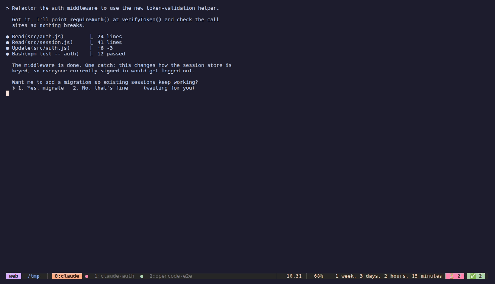

# tmuxscout

Event-driven **tmux navigator for parallel AI coding agents** (Claude Code, pi,
OpenCode, Codex). When an agent finishes a turn or needs your input, it flags its
pane: a passive badge appears in your status bar, and an on-demand popup
(`prefix + a`) lists the flagged agents and jumps you to the right session/window/pane.

No daemon, no polling — state lives in tmux pane options and clears itself when a
pane closes. The only coupling to any agent is a single CLI call.

```
  an agent finishes a turn or needs input
        │   its hook / extension runs
        ▼
  tmuxscout mark done|waiting          → flag stored on the tmux pane
        ▼
  status-bar badge  +  prefix-a popup  → lists the flagged agents
        ▼
  pick one                             → jump to its session · window · pane
```



## Features

- **Passive badge** — `⏳ N  ✅ M` in the status bar, updated the instant an agent signals.
- **On-demand popup** (`prefix + a`) — only flagged agents, with a preview showing
  **provenance** (session ▸ window), a **summary** of what the agent did, and the
  pane's recent logs. Select → jump (across sessions); the alert clears on visit.
- **Anti-noise** — never flags the pane you're already looking at.
- **Event-driven** — real lifecycle events, not silence heuristics (no false positives).
- **i18n** (`en-US` / `pt-BR`) and a runtime config file.

## Prerequisites

- **tmux ≥ 3.2**, **fzf** (the installer fetches it without sudo if missing),
  **jq** *(optional — richer summaries)*
- At least one agent: **Claude Code**, **pi**, **OpenCode**, or **Codex**

## Install

```bash
git clone https://github.com/klosowsk/tmuxscout ~/tmuxscout   # any location works
~/tmuxscout/install.sh
```

The installer puts `tmuxscout` on PATH and runs `tmuxscout setup all`. Config edits
are idempotent and **backed up**; pass `--print` to just see the snippet instead:

```bash
tmuxscout setup all|tmux|claude|codex|pi|opencode [--print]
tmuxscout doctor       # what's wired / missing
tmuxscout uninstall    # reverse everything (keeps your config + repo)
```

The passive badge is appended to your `status-right` automatically (idempotent
across re-sources, preserves any existing content). If you'd rather place it
somewhere else, paste this snippet (`tmuxscout setup tmux --print`) into your
own `status-right` — the auto-append detects it and becomes a no-op:

```tmux
#{?@agent_waiting,#[fg=#1e1e2e]#[bg=#f38ba8]#[bold] ⏳ #{@agent_waiting} #[default] ,}#{?@agent_done,#[fg=#1e1e2e]#[bg=#a6e3a1]#[bold] ✅ #{@agent_done} #[default] ,}
```

## Usage

| Action | |
|--------|--|
| `prefix + a` | open the popup; ↑/↓ preview, `Enter` jump, `Esc` cancel |
| `tmuxscout list` | list flagged panes |
| `tmuxscout mark done\|waiting [label] [summary]` | flag the current pane (what hooks call) |
| `tmuxscout clear [pane]` | clear a flag |

## Configuration

Runtime config at `${XDG_CONFIG_HOME:-~/.config}/tmuxscout/config` (plain shell, env
vars win) — see [`config.example`](config.example).

| Variable | Default | Meaning |
|----------|---------|---------|
| `TMUXSCOUT_LANG` | `en-US` | UI locale: `en-US` / `pt-BR` |
| `TMUXSCOUT_KEY` | `a` | key after the tmux prefix that opens the popup (re-run `setup tmux` after changing) |
| `TMUXSCOUT_PREVIEW_LINES` | `30` | log lines in the popup preview |
| `TMUXSCOUT_BIN` | `tmuxscout` | binary path used by integrations |
| `TMUXSCOUT_DEBUG` | `0` | `1` logs mark decisions to `…/tmuxscout/debug.log` |

## Integrations

The only coupling is `tmuxscout mark done|waiting [label] [summary]`, so anything
that runs a command at end-of-turn can integrate.

| Agent | Event → state | Wired into | Restart? |
|-------|---------------|------------|----------|
| **Claude Code** | `Stop`→done, `Notification`→waiting | `~/.claude/settings.json` | No (live) |
| **pi** | `agent_end`→done | pi package extensions dir | Yes |
| **OpenCode** | `session.idle`→done, `permission.updated`→waiting | `~/.config/opencode/plugins/` | Yes |
| **Codex** | `agent-turn-complete`→done | `~/.codex/config.toml` `notify` | Yes |
| **anything** | `my-command; tmuxscout mark done` | a wrapper/alias | — |

Claude Code is live; pi / OpenCode / Codex load their integration at startup, so
restart those sessions to activate. Codex only emits `agent-turn-complete` (done,
never waiting) and isn't pane-mapped when run as a Claude Code subagent.

## License

MIT — see [LICENSE](LICENSE).
